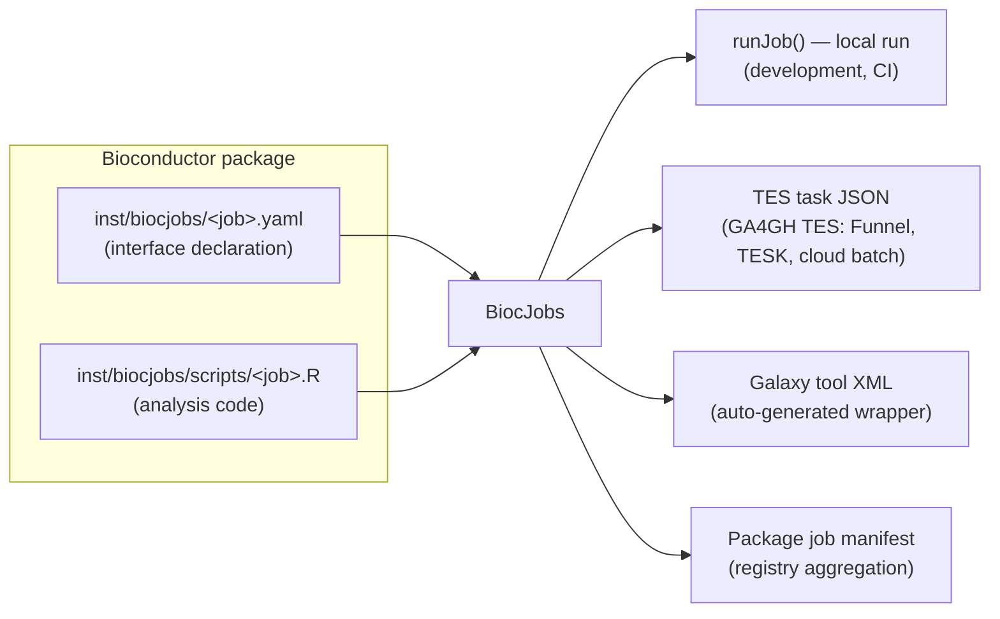

# BiocJobs: declare dispatchable jobs inside Bioconductor packages

**BiocJobs** is a lightweight framework that lets a Bioconductor package
declare, inside the package itself, the units of work it can perform
non-interactively — *jobs* — and then automatically generates everything
workflow infrastructure needs to dispatch those jobs: [GA4GH
TES](https://github.com/ga4gh/task-execution-schemas) task definitions,
[Galaxy](https://galaxyproject.org) tool wrappers, and a machine-readable
manifest for registry building. One declaration, many execution targets, no
hand-written wrappers.

A package opts in by adding exactly two kinds of files under `inst/biocjobs/`:

```
mypackage/
└── inst/
    └── biocjobs/
        ├── my-analysis.yaml          # what the job needs, produces, exposes
        └── scripts/
            └── my-analysis.R         # plain R, ~1 page, pure analysis code
```

Nothing else about the package changes. No new imports, no code changes, no
build-system requirements. Packages that are inherently interactive simply
don't add the directory.

## Why

Bioconductor ships thousands of software packages. A large fraction of what
they do is *batch-shaped*: a well-defined analysis with file inputs, file
outputs, and a handful of parameters. Today, every workflow system that wants
to offer such an analysis — Galaxy, Nextflow, CWL/WDL engines, cloud batch
systems — needs a **hand-written wrapper**, maintained by someone who is
usually *not* the package author, drifting out of sync with the package at
every release. The IUC Galaxy wrapper for DESeq2 is excellent, but it took
expert effort to build and takes expert effort to keep current; the long tail
of Bioconductor packages will never get that treatment.

BiocJobs inverts the ownership: the **package author** — the person who knows
which entry points make sense non-interactively, what the inputs mean, and
which parameters matter — declares the job once, next to the code, versioned
with the code, tested with the code. Wrappers become build artifacts, not
maintained code.

Nothing like this currently exists in Bioconductor:
[BiocParallel](https://bioconductor.org/packages/BiocParallel/) parallelizes
computation *inside* a live R session;
[Rcwl/RcwlPipelines](https://bioconductor.org/packages/RcwlPipelines/)
wrap tools in CWL from a centrally curated catalog, authored by analysts
rather than shipped by the packages themselves. BiocJobs is the missing
piece: a *package-owned, declarative* job interface that infrastructure can
consume without evaluating any package code.

## How it works



Three principles hold everything together:

1. **The YAML is the single source of truth.** It declares inputs, outputs,
   configuration options (with types), resource needs, and citations. Build
   infrastructure can enumerate and validate every job in a package tarball
   *without installing or executing anything*.

2. **One runtime contract.** Every input, output, and option is passed as a
   `--name value` command-line pair. Job scripts start with one line —
   `params <- BiocJobs::jobParams("<pkg>", "<job>")` — which parses the
   command line *against the declaration*: type coercion, defaults, choice
   validation, required-input checks, output-directory creation. The rest of
   the script is plain analysis code.

3. **One canonical command.** Every execution target launches the same
   self-locating invocation:

   ```
   Rscript -e 'BiocJobs::execJob("<pkg>", "<job>")' --input path --option value --output path
   ```

   `execJob()` finds the script inside the *installed* package, so generated
   artifacts contain no absolute paths and never go stale against the
   installed package version.

## The job specification

```yaml
biocjobs: "1.0"            # spec version
name: my-analysis          # job id: [a-z0-9][a-z0-9._-]*
package: mypackage         # host package
title: One-line title
tagline: short description for tool listings   # optional
description: >             # long description for humans
  What this job does.
version: "1.0.0"           # job version (drives wrapper versioning)
script: scripts/my-analysis.R   # relative to inst/biocjobs/

inputs:                    # files the job consumes
  - name: counts           # becomes --counts <path>
    format: tsv            # controlled vocabulary, see jobFormats()
    label: Raw count matrix
    help: Longer explanation shown in UIs.
    # required: false      # inputs are required unless stated otherwise

outputs:                   # files the job must produce
  - name: results          # becomes --results <path>
    format: tsv
    label: Results table

options:                   # typed configuration
  - name: alpha            # becomes --alpha <value>
    type: float            # boolean | choice | string | integer | float
    default: 0.1           # every option needs a default or required: true
    min: 0                 # optional bounds (integer/float)
    max: 1
    label: FDR threshold
  - name: method
    type: choice
    choices: [apeglm, ashr, none]
    default: apeglm
  - name: design
    type: string
    default: "~ condition"
    allow_chars: ["~"]     # extend Galaxy's text sanitizer where needed

resources:                 # scheduling hints
  cpus: 1
  memory_gb: 4
  disk_gb: 10

depends: [apeglm]          # R packages the script needs beyond the host
                           # package (e.g. Suggests used at runtime)

container: null            # optional image override; defaults to
                           # bioconductor/bioconductor_docker:<current release>

citations:
  - doi: 10.1186/s13059-014-0550-8

tests:                     # optional; becomes Galaxy <tests> cases
  - inputs:  {counts: test-data/counts.tsv}
    options: {method: apeglm}
    outputs:
      results: {file: test-data/results.tsv, compare: sim_size, delta: 3000}
```

The `format` vocabulary (`tsv`, `csv`, `rds`, `fasta`, `fastq`, `bam`,
`vcf`, `pdf`, …) maps each format to a Galaxy datatype and a file extension;
see `jobFormats()`. Unknown formats pass through verbatim and are flagged as
validation notes, not errors.

Inputs, outputs, and options share one `--flag` namespace; `validateJob()`
enforces uniqueness, name patterns, type/default consistency, script
existence, and more. `BiocJobs::biocjobsCLI() validate <pkg>` exits non-zero
on errors — designed to slot into `R CMD check`-adjacent infrastructure such
as BiocCheck or the Bioconductor Build System.

## From declaration to execution

Everything is reachable both from R and from a shell (for automation):

```bash
# discover and validate
Rscript -e 'BiocJobs::biocjobsCLI()' list     /path/to/pkg
Rscript -e 'BiocJobs::biocjobsCLI()' validate /path/to/pkg

# run locally (works from an uninstalled source checkout)
Rscript -e 'BiocJobs::biocjobsCLI()' run /path/to/pkg my-analysis \
    --counts counts.tsv --alpha 0.05

# generate execution artifacts
Rscript -e 'BiocJobs::biocjobsCLI()' tes      /path/to/pkg my-analysis --out task.json
Rscript -e 'BiocJobs::biocjobsCLI()' galaxy   /path/to/pkg my-analysis --out tool.xml
Rscript -e 'BiocJobs::biocjobsCLI()' manifest /path/to/pkg --out manifest.json
```

**TES target.** Each job maps 1:1 onto a GA4GH TES v1.1 task: inputs/outputs
become `tesInput`/`tesOutput` entries staged at fixed container paths,
`resources` become `tesResources`, and the final executor runs the canonical
command inside a Bioconductor container. When the generic
`bioconductor_docker` image is used, a *bootstrap executor* is prepended
that installs the host package, BiocJobs, and any declared `depends` via
`BiocManager` (binary installs inside `bioconductor_docker`) — so the task
is genuinely executable out of the box; point `container:` at a
purpose-built image to skip it. URLs not known at generation time are
emitted as `{{inputs.counts.url}}`-style placeholders and the task is tagged
`biocjobs.template: "true"`, so the JSON acts as a *submission template*:
fill in the URLs (and any unset required options) and POST it to any TES
endpoint (Funnel, TESK, cloud implementations). If an unfilled placeholder
ever reaches a running job, `jobParams()` rejects it by name rather than
letting a literal `{{...}}` leak into the analysis.

**Galaxy target.** Each job becomes a complete Galaxy tool: typed params
(`data`, `boolean`, `select`, `text` with sanitizers/validators, `integer`,
`float` with bounds), outputs with datatypes and labels, `<tests>` from the
spec's test cases — with the referenced files staged into a `test-data/`
directory beside the XML, the layout `planemo test` expects — DOI
citations, a `bioconductor` xref, and bioconda requirements
(`bioconductor-<pkg>` + `bioconductor-biocjobs`) that Galaxy resolves to
conda environments or mulled BioContainers images. Tool versions follow the
IUC convention with the wrapped package version leading
(`1.52.0+biocjobs1.0.0`), so regenerating after a Bioconductor release
always produces a new tool version.

**Manifest / registry.** `jobManifest()` summarizes every job a package
declares — full typed interface, resources, container, canonical command —
as JSON. Because discovery needs no code evaluation, the Bioconductor build
system could aggregate manifests across all packages at build time into a
**Bioconductor-wide job registry**, from which TES templates and Galaxy tool
sheds regenerate automatically at every release. The pipeline is:

```
package tarballs ──▶ findJobs()/validateJob() ──▶ per-package manifests
                 ──▶ registry ──▶ {TES templates, Galaxy tools, ...} per release
```

## Worked example: DESeq2

[`examples/DESeq2/`](examples/DESeq2/) contains everything a DESeq2
maintainer would add, plus everything that gets generated from it. The job
runs the canonical DESeq2 workflow — count matrix + sample table + design
formula in; results table, normalized counts, and MA plot out — with typed
options for the contrast, FDR threshold, LFC shrinkage method, and
pre-filtering, demonstrating every option type in the spec.

**What the maintainer writes** (the only two files that go into DESeq2):

- [`inst/biocjobs/deseq2-differential-expression.yaml`](examples/DESeq2/inst/biocjobs/deseq2-differential-expression.yaml)
  — the declaration: 2 inputs, 3 outputs, 9 typed options, resources,
  runtime `depends` (apeglm/ashr for shrinkage), citations, and one test
  case.
- [`inst/biocjobs/scripts/deseq2-differential-expression.R`](examples/DESeq2/inst/biocjobs/scripts/deseq2-differential-expression.R)
  — one page of plain DESeq2 code. Note what is *absent*: no argument
  parsing, no type checking, no usage message — `jobParams()` supplies all
  of it from the YAML. The script encodes the analysis correctly once:
  sample/column alignment, releveling the contrast factor to the reference
  level so `apeglm` shrinkage has its coefficient, vignette-recommended
  pre-filtering.

**What gets generated** (never written by hand, regenerated at each release):

- [`generated/deseq2-differential-expression.tes.json`](examples/DESeq2/generated/deseq2-differential-expression.tes.json)
  — a TES v1.1 task template. Validated against the official GA4GH TES 1.1
  `tesTask` OpenAPI schema.
- [`generated/deseq2_differential_expression.xml`](examples/DESeq2/generated/deseq2_differential_expression.xml)
  — a complete Galaxy tool, with its test data staged under
  [`generated/test-data/`](examples/DESeq2/generated/test-data/). Validates
  against Galaxy's official tool XSD
  (`xmllint --schema galaxy.xsd ... : validates`).
- [`generated/manifest.json`](examples/DESeq2/generated/manifest.json)
  — the package's job manifest for registry aggregation.

**Proof it runs.** With DESeq2 (1.52.0, Bioconductor 3.23) installed, on
simulated data ([`test-data/`](examples/DESeq2/test-data/), 600 genes × 6
samples, 60 true DE genes):

```bash
Rscript -e 'BiocJobs::biocjobsCLI()' run examples/DESeq2 deseq2-differential-expression \
    --counts examples/DESeq2/test-data/counts.tsv \
    --coldata examples/DESeq2/test-data/coldata.tsv \
    --design "~ condition" \
    --contrast_factor condition \
    --contrast_numerator treated \
    --contrast_denominator control \
    --alpha 0.05 --shrinkage apeglm
```

```
pre-filter: keeping 509 of 600 genes
...
significant genes at padj < 0.05: 43
output results: .../results.tsv
output normalized_counts: .../normalized_counts.tsv
output ma_plot: .../ma_plot.pdf
```

The same job, unchanged, is what the generated TES task runs in a
`bioconductor/bioconductor_docker:RELEASE_3_23` container and what the
generated Galaxy tool runs in a mulled BioContainers environment.

## Containers and dependencies

At runtime a job needs three things in its environment: R, the host package
(plus declared `depends`), and BiocJobs (whose only job at runtime is
`jobParams()`; it brings just `yaml`/`jsonlite`/`xml2` along). The two
targets get there differently:

- **TES**: the default image is `bioconductor/bioconductor_docker:<release>`,
  with the bootstrap executor installing whatever is missing at task start.
  For production use, point `container:` at an image with everything
  pre-installed (the bootstrap then disappears from generated tasks) — for
  Bioconductor packages, the auto-built
  `quay.io/biocontainers/bioconductor-<pkg>` images are a natural base.
- **Galaxy**: requirements are declared as bioconda packages. Bioconda
  auto-packages *every* Bioconductor package as `bioconductor-<name>`, so
  once BiocJobs is accepted into Bioconductor, `bioconductor-biocjobs`
  appears automatically and Galaxy's mulled-container machinery resolves the
  pair with zero manual packaging work.

Until BiocJobs is in Bioconductor (and therefore on bioconda), runtime
environments need it installed manually — that is the one bootstrap step
this proposal asks of the project.

## Which packages are good candidates

A job should be a **complete, non-interactive unit of analysis**: files in,
files out, parameters known up front, no human in the loop. Differential
expression (DESeq2, edgeR, limma), amplicon denoising (dada2), peak calling,
quantification import (tximport), normalization pipelines, batch effect
removal — all fit. Packages whose value is interactive exploration
(visualization, iterative model tuning, browsers) should not declare jobs;
opting out is the default.

## Design notes

- **Why YAML sidecars instead of roxygen tags or R calls?** Discovery must
  work from a tarball, in any language, without evaluating R code — a hard
  requirement for build infrastructure and a security boundary. YAML is also
  the lingua franca of the workflow community (Galaxy, CWL, nf-core).
- **Why a flat `--name value` contract?** It is trivially generatable from
  every workflow language, trivially parseable everywhere, and keeps
  generated wrappers readable and debuggable by hand.
- **Why `execJob()` instead of script paths?** Generated artifacts must not
  contain filesystem paths that vary by installation. Resolving the script
  through the installed package makes artifacts location-independent and
  version-faithful.
- **Failure semantics**: scripts fail loudly (non-zero exit), `detect_errors="exit_code"`
  in Galaxy and TES executor exit codes propagate naturally.

## How this has been verified

- `BiocJobs` passes `R CMD check` (0 errors, 0 warnings) with a full
  testthat suite covering spec parsing, validation, the runtime contract,
  the local runner, and both generators, including a shipped `toy` example
  package exercised end-to-end in a child process.
- The generated Galaxy wrapper validates against Galaxy's official tool XSD;
  the generated TES task validates against the GA4GH TES 1.1 `tesTask`
  OpenAPI schema, satisfies the create-task required-field rules, and sends
  no server-owned fields.
- The DESeq2 job was executed end-to-end against DESeq2 1.52.0
  (Bioconductor 3.23) on simulated data, recovering the planted signal; the
  outputs are the staged Galaxy test expectations.
- Failure paths fail loudly with actionable messages: duplicate gene
  identifiers, missing/NA count cells, non-syntactic factor levels (which
  DESeq2 would otherwise silently rename out from under the requested
  contrast), unfilled TES template placeholders, and malformed
  specifications are all caught with named errors rather than downstream
  crashes.

## Current scope and roadmap

v1 deliberately keeps the model small: single-file inputs/outputs, five
option types, one executor per job. On the roadmap:

- multi-file inputs / Galaxy collections (`multiple: true`)
- a reserved `threads` option wired to `resources.cpus` and Galaxy's
  `\${GALAXY_SLOTS}`
- further targets: CWL `CommandLineTool`, WDL tasks, Nextflow modules —
  each is one generator function away, consuming the same specs
- `validateJob()` integration into BiocCheck, and manifest aggregation in
  the Bioconductor Build System
- a curated job registry at `bioconductor.org` regenerated per release

## Repository layout

| Path | Contents |
|---|---|
| [`BiocJobs/`](BiocJobs/) | the framework R package (spec parser/validator, runtime contract, local runner, TES + Galaxy generators, manifest, CLI; full testthat suite) |
| [`examples/DESeq2/`](examples/DESeq2/) | the worked example: maintainer-authored files under `inst/biocjobs/`, generated artifacts under `generated/`, simulated data under `test-data/` |

To try it:

```bash
R CMD INSTALL BiocJobs
Rscript -e 'BiocJobs::biocjobsCLI()' validate examples/DESeq2
Rscript -e 'BiocJobs::biocjobsCLI()' galaxy examples/DESeq2 deseq2-differential-expression
```
